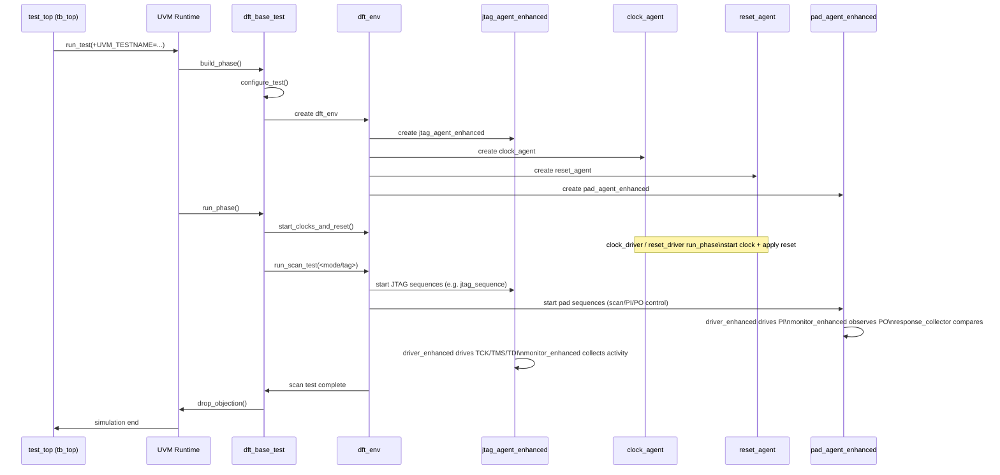
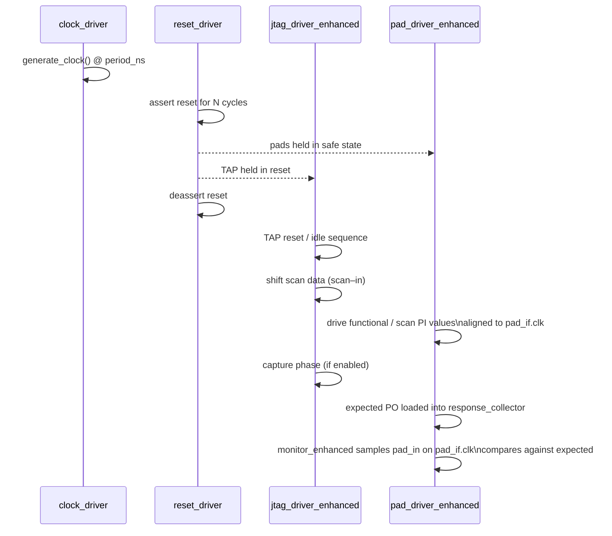

## DFT UVM Testbench – Sequence Diagrams

### High–Level Test Execution Flow

```mermaid
sequenceDiagram
    participant TB as test_top (tb_top)
    participant UVM as UVM Runtime
    participant T as dft_base_test
    participant ENV as dft_env
    participant JTAG as jtag_agent_enhanced
    participant CLK as clock_agent
    participant RST as reset_agent
    participant PAD as pad_agent_enhanced

    TB->>UVM: run_test(+UVM_TESTNAME=...)
    UVM->>T: build_phase()
    T->>T: configure_test()
    T->>ENV: create dft_env
    ENV->>JTAG: create jtag_agent_enhanced
    ENV->>CLK: create clock_agent
    ENV->>RST: create reset_agent
    ENV->>PAD: create pad_agent_enhanced

    UVM->>T: run_phase()
    T->>ENV: start_clocks_and_reset()
    note over CLK,RST: clock_driver / reset_driver run_phase\nstart clock + apply reset
    T->>ENV: run_scan_test(<mode/tag>)
    ENV->>JTAG: start JTAG sequences (e.g. jtag_sequence)
    ENV->>PAD: start pad sequences (scan/PI/PO control)
    PAD->>PAD: driver_enhanced drives PI\nmonitor_enhanced observes PO\nresponse_collector compares
    JTAG->>JTAG: driver_enhanced drives TCK/TMS/TDI\nmonitor_enhanced collects activity

    ENV->>T: scan test complete
    T->>UVM: drop_objection()
    UVM->>TB: simulation end
```

### Timing Relationship: Clock, Reset, JTAG, Pad

```mermaid
sequenceDiagram
    participant CLK as clock_driver
    participant RST as reset_driver
    participant JTAG as jtag_driver_enhanced
    participant PAD as pad_driver_enhanced

    CLK->>CLK: generate_clock() @ period_ns
    RST->>RST: assert reset for N cycles
    RST-->>PAD: pads held in safe state
    RST-->>JTAG: TAP held in reset

    RST->>RST: deassert reset
    JTAG->>JTAG: TAP reset / idle sequence

    JTAG->>JTAG: shift scan data (scan–in)
    PAD->>PAD: drive functional / scan PI values\naligned to pad_if.clk

    JTAG->>JTAG: capture phase (if enabled)
    PAD->>PAD: expected PO loaded into response_collector

    PAD->>PAD: monitor_enhanced samples pad_in on pad_if.clk\ncompares against expected
```

