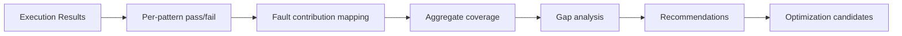

# Coverage Analysis Flow Diagram

```mermaid
flowchart LR
  A[Execution Results] --> B[Per-pattern pass/fail]
  B --> C[Fault contribution mapping]
  C --> D[Aggregate coverage]
  D --> E[Gap analysis]
  E --> F[Recommendations]
  F --> G[Optimization candidates]
```

