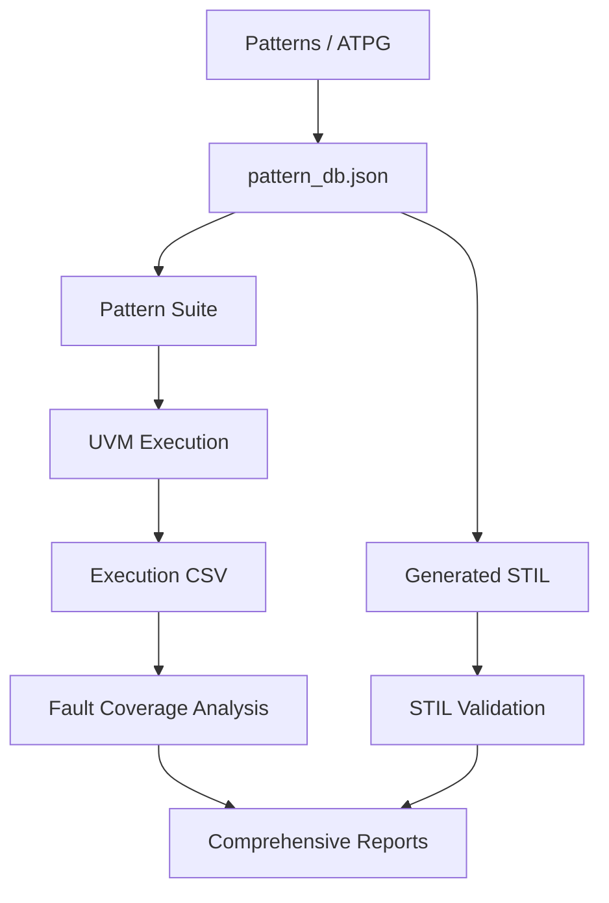

# Data Flow Diagram

```mermaid
flowchart TD
  P[Patterns / ATPG] --> DB[pattern_db.json]
  DB --> STIL[Generated STIL]
  DB --> SUITE[Pattern Suite]
  SUITE --> SIM[UVM Execution]
  SIM --> CSV[Execution CSV]
  CSV --> FC[Fault Coverage Analysis]
  STIL --> VAL[STIL Validation]
  FC --> REP[Comprehensive Reports]
  VAL --> REP
```

