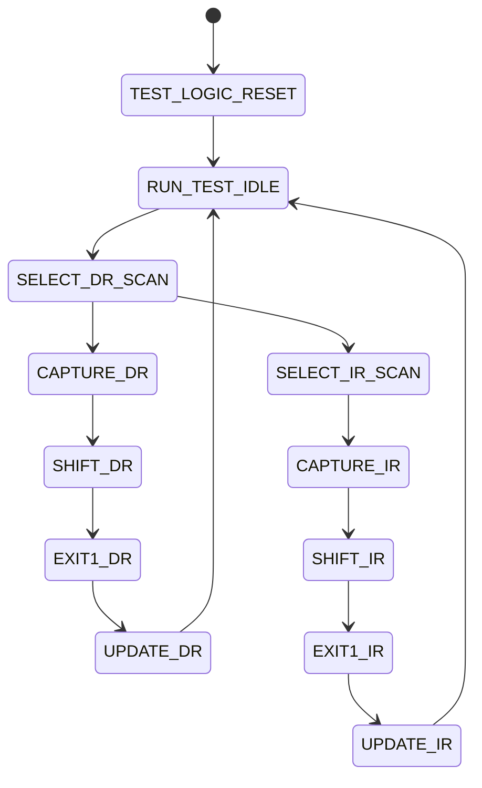

# JTAG TAP State Machine (Simplified)

```mermaid
stateDiagram-v2
  [*] --> TEST_LOGIC_RESET
  TEST_LOGIC_RESET --> RUN_TEST_IDLE
  RUN_TEST_IDLE --> SELECT_DR_SCAN
  SELECT_DR_SCAN --> CAPTURE_DR
  CAPTURE_DR --> SHIFT_DR
  SHIFT_DR --> EXIT1_DR
  EXIT1_DR --> UPDATE_DR
  UPDATE_DR --> RUN_TEST_IDLE
  SELECT_DR_SCAN --> SELECT_IR_SCAN
  SELECT_IR_SCAN --> CAPTURE_IR
  CAPTURE_IR --> SHIFT_IR
  SHIFT_IR --> EXIT1_IR
  EXIT1_IR --> UPDATE_IR
  UPDATE_IR --> RUN_TEST_IDLE
```

