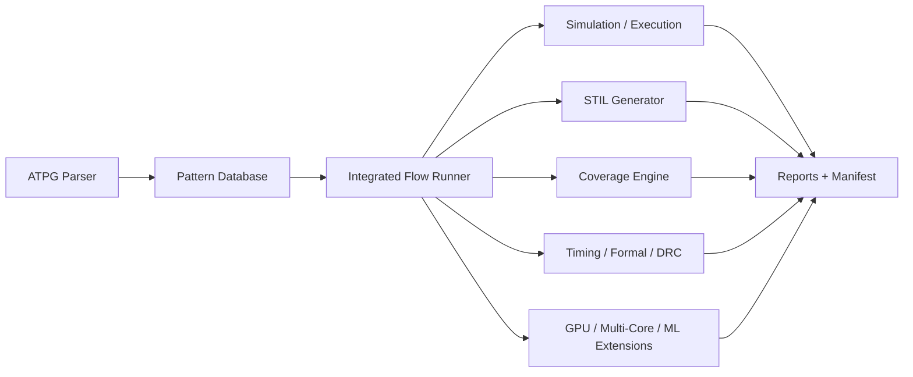

# System Architecture Diagram

```mermaid
flowchart LR
  A[ATPG Parser] --> B[Pattern Database]
  B --> C[Integrated Flow Runner]
  C --> D[Simulation / Execution]
  C --> E[STIL Generator]
  C --> F[Coverage Engine]
  C --> G[Timing / Formal / DRC]
  C --> H[GPU / Multi-Core / ML Extensions]
  D --> I[Reports + Manifest]
  E --> I
  F --> I
  G --> I
  H --> I
```

