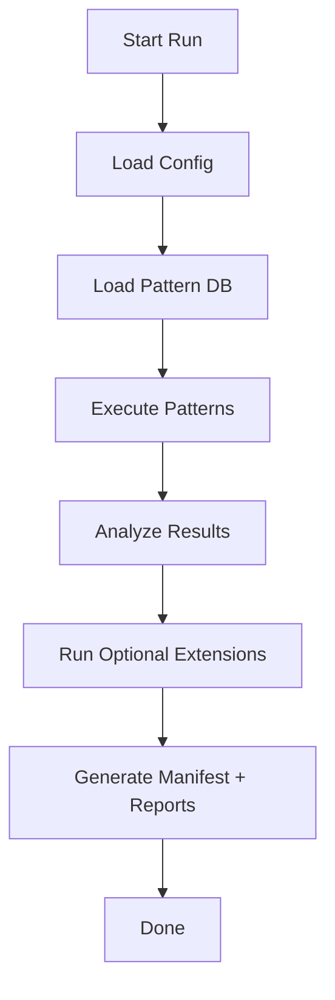

# Test Execution Flow Diagram

```mermaid
flowchart TD
  START[Start Run] --> CFG[Load Config]
  CFG --> PAT[Load Pattern DB]
  PAT --> RUN[Execute Patterns]
  RUN --> ANALYZE[Analyze Results]
  ANALYZE --> EXT[Run Optional Extensions]
  EXT --> MANIFEST[Generate Manifest + Reports]
  MANIFEST --> END[Done]
```

